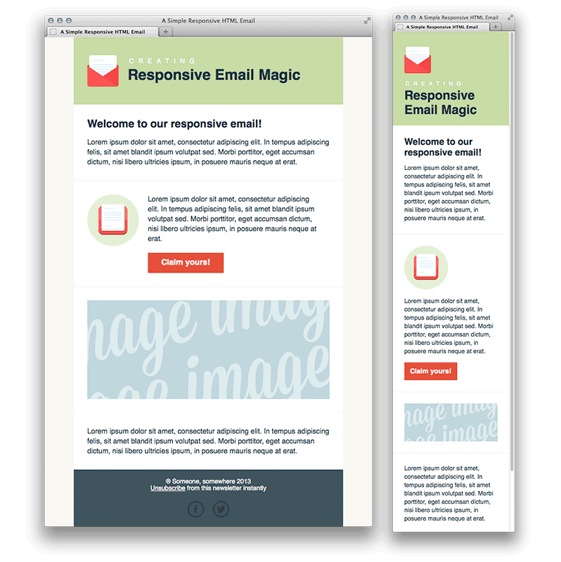

# Creating a Simple Responsive HTML Email



Coded this HTML email template by following tutsplus article - [Creating a Simple Responsive HTML Email](https://webdesign.tutsplus.com/articles/creating-a-simple-responsive-html-email--webdesign-12978)

Later added gulp workflow with nunjucks templating and scss setup.

Demo can be seen in here - https://saabbir.github.io/responsive-email-magic-html/

## Features

- Uses Gulp 4 for automation
- Uses SCSS for CSS
- Uses Nunjucks for templating

## Getting Started

Clone this repo:

```sh
git clone https://github.com/Saabbir/responsive-email-magic-html.git
```

This project is based on [Node.js](https://nodejs.org/en/). To install the necessary packages, run this command in the root folder of the site:

```sh
npm install
```

### After Installation

- Run `npm run dev` from root folder for a development server and live reloading
- Run `npm run build` from root folder for production build

## Dev Dependencies

This project uses a number of open source projects for the development build:

- [browser-sync](https://ghub.io/browser-sync)
- [del](https://ghub.io/del)
- [gulp](https://ghub.io/gulp)
- [gulp-autoprefixer](https://ghub.io/gulp-autoprefixer)
- [gulp-cache](https://ghub.io/gulp-cache)
- [gulp-imagemin](https://ghub.io/gulp-imagemin)
- [gulp-inline-css](https://ghub.io/gulp-inline-css)
- [gulp-nunjucks-render](https://ghub.io/gulp-nunjucks-render)
- [gulp-sass](https://ghub.io/gulp-sass)

## References

- [tutsplus-article](https://webdesign.tutsplus.com/articles/creating-a-simple-responsive-html-email--webdesign-12978)
- [A Gulp Workflow for Building HTML Email](https://bitsofco.de/a-gulp-workflow-for-building-html-email/)
- [gulp-email-workflow](https://github.com/ireade/gulp-email-workflow)